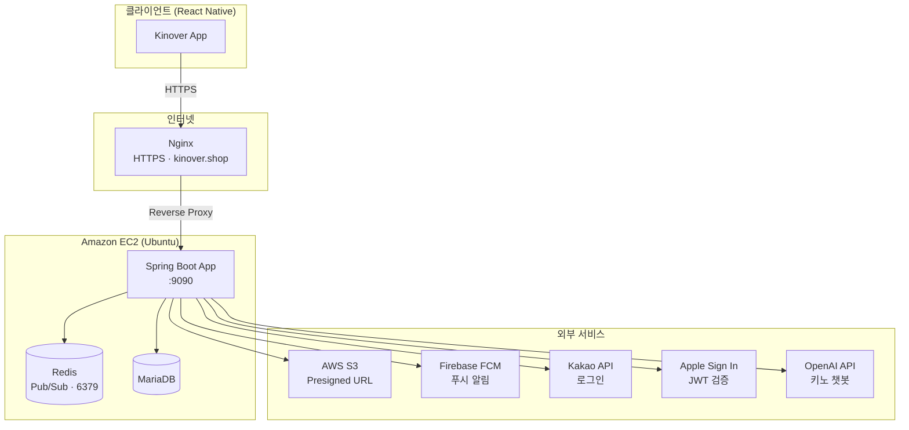
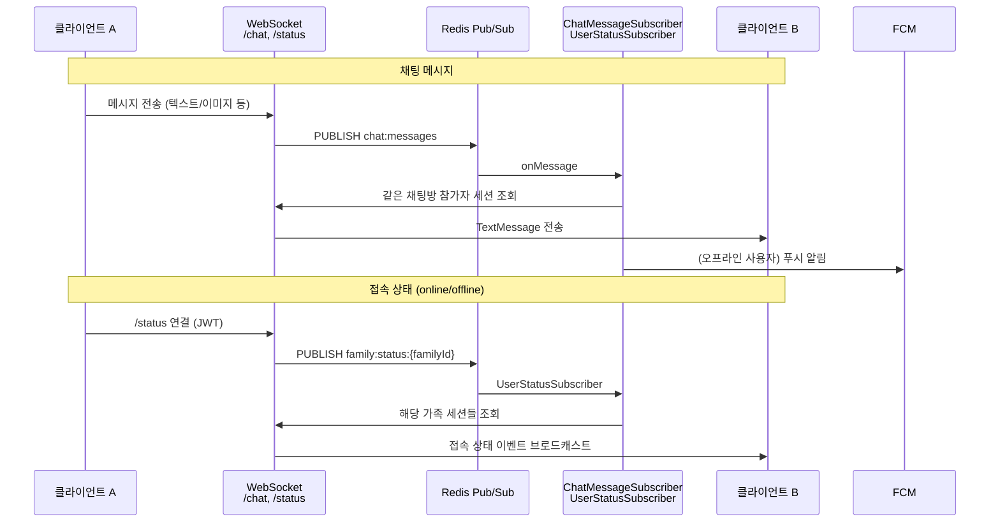
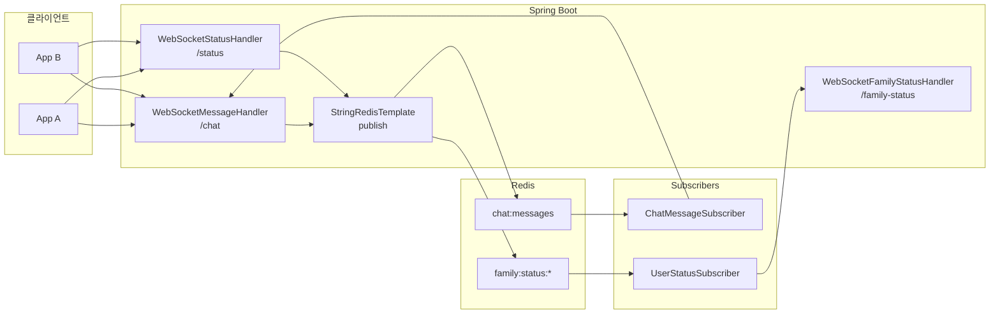
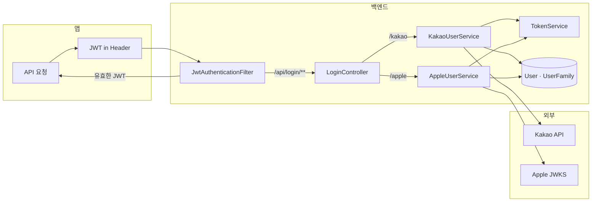
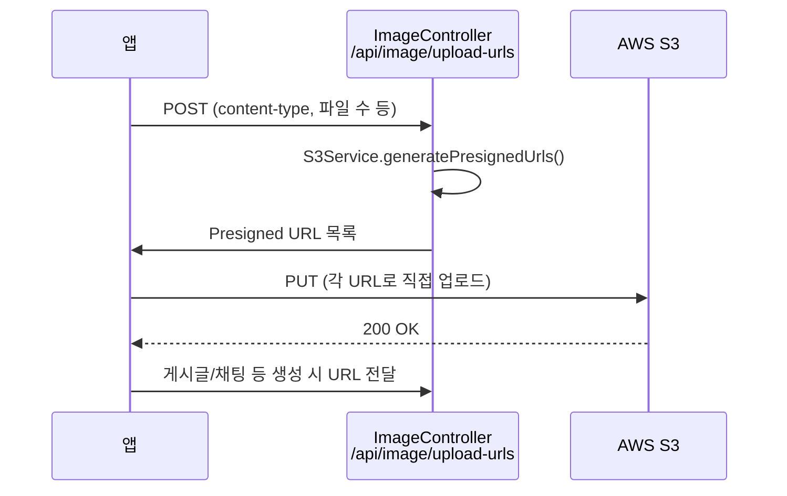

# Kinover 백엔드 아키텍처

## 1. 시스템 아키텍처 (전체)



---

## 2. 애플리케이션 레이어 (Spring Boot 내부)

```mermaid
flowchart LR
    subgraph Entry["진입점"]
        REST["REST API<br/>/api/*"]
        WS["WebSocket<br/>/chat, /status, /family-status"]
    end

    subgraph Security["보안"]
        JWT[JwtAuthenticationFilter]
        Security[SecurityConfig<br/>CORS · Stateless]
    end

    subgraph Controller["Controller Layer"]
        LoginCtrl[LoginController]
        UserCtrl[UserController]
        FamilyCtrl[FamilyController]
        PostCtrl[PostController]
        ChatCtrl[ChatRoomController]
        ScheduleCtrl[ScheduleController]
        ImageCtrl[ImageController]
        CategoryCtrl[CategoryController]
        FcmCtrl[FcmTokenController]
        Others[Comment, Challenge, ...]
    end

    subgraph Service["Service Layer"]
        Auth[Kakao/Apple UserService]
        UserSvc[UserService]
        FamilySvc[FamilyService]
        PostSvc[PostService]
        ChatSvc[ChatRoomService]
        MessageSvc[MessageService]
        ScheduleSvc[ScheduleService]
        S3Svc[S3Service]
        FcmSvc[FcmNotificationService]
        OpenAiSvc[OpenAiService]
    end

    subgraph Data["Data Layer"]
        Repos[(JPA Repositories)]
    end

    REST --> JWT
    WS --> JWT
    JWT --> Security
    Security --> LoginCtrl
    Security --> UserCtrl
    Security --> FamilyCtrl
    Security --> PostCtrl
    Security --> ChatCtrl
    Security --> ScheduleCtrl
    Security --> ImageCtrl
    Security --> CategoryCtrl
    Security --> FcmCtrl
    Security --> Others

    LoginCtrl --> Auth
    UserCtrl --> UserSvc
    FamilyCtrl --> FamilySvc
    PostCtrl --> PostSvc
    ChatCtrl --> ChatSvc
    ImageCtrl --> S3Svc
    FcmCtrl --> FcmSvc

    UserSvc --> Repos
    FamilySvc --> Repos
    PostSvc --> Repos
    ChatSvc --> Repos
    MessageSvc --> Repos
    ScheduleSvc --> Repos
    Auth --> Repos
```

---

## 3. 실시간 채팅 & 접속 상태 (WebSocket + Redis)





---

## 4. 인증 흐름



---

## 5. 이미지 업로드 (Presigned URL)



---

## 6. CI/CD (GitHub Actions → EC2)

```mermaid
flowchart LR
    subgraph GitHub["GitHub"]
        Push[push to main]
        Build[Build bootJar]
        Artifact[app.jar]
    end

    subgraph EC2["EC2"]
        Deploy[/deploy/app.jar]
        Systemd[systemd<br/>kinover-backend.service]
        App[Spring Boot]
    end

    Push --> Build
    Build --> Artifact
    Artifact -->|scp| Deploy
    Deploy -->|ssh systemctl restart| Systemd
    Systemd --> App
```

---

## 7. API 도메인 요약

| 도메인 | 경로 | 주요 기능 |
|--------|------|-----------|
| 인증 | `/api/login`, `/api/auth` | Kakao/Apple 로그인, 토큰 발급 |
| 사용자 | `/api/user` | userinfo, 프로필, 알림, 배지 |
| 가족 | `/api/family` | 생성/참여/탈퇴, 공지, family-status |
| 게시글 | `/api/posts` | CRUD, 이미지, 알림 설정 |
| 댓글 | `/api/comments` | CRUD, 알림 설정 |
| 채팅방 | `/api/chatRoom` | 생성/참여/나가기, 메시지 fetch, 읽음, 미디어 |
| 일정 | `/api/schedules` | 조회/추가/삭제, 일별 개수 |
| 이미지 | `/api/image` | Presigned URL 발급 |
| 카테고리 | `/api/categories` | CRUD |
| FCM | `/api/fcm` | 토큰 등록 |
| WebSocket | `/chat`, `/status`, `/family-status` | 실시간 메시지, 접속 상태 |

이 문서는 프로젝트 루트의 `docs/ARCHITECTURE.md`에서 유지됩니다.
